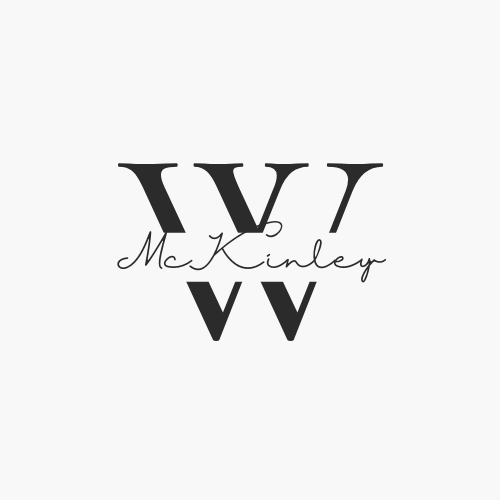

# About the Team

  

The development team known as The Cabinet was formed to develop a mobile application for and with the William McKinley Presidential Library and Museum. Throughout this semester, the team will be using this site to post updates as we make progress with applicaiton development. We are excited to get to work with The McKinley Museum and to continuously update our readers over the coming months!

# Project Log

## 2/2/22
### First Update
---
Since this is our first project log item, the team wants to use this as a chance to catch our readers up on the work the team has done so far this semester. The first large item our team has completed would the draft for the Software Requirements Specification Document. The team put in many hours and performed research in order to complete the document. Also, our team has had the chance to meet once with the McKinley team so far this semester. During our meeting, the team was able to obtain information about the museum and learn about the requirements for the application. Our team plans to continue to communicate with museum staff throughout the semester. Finally, the team's focus for the coming week will be to make progress on the Preliminary Product Schedule and the Initial Press Release.

# Project Documents
[SRS Document](documents/McKinleySoftwareRequirementsSpecification.pdf)

